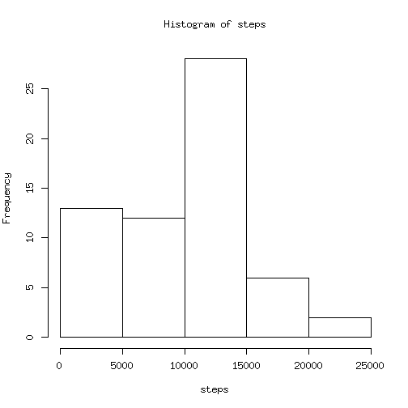
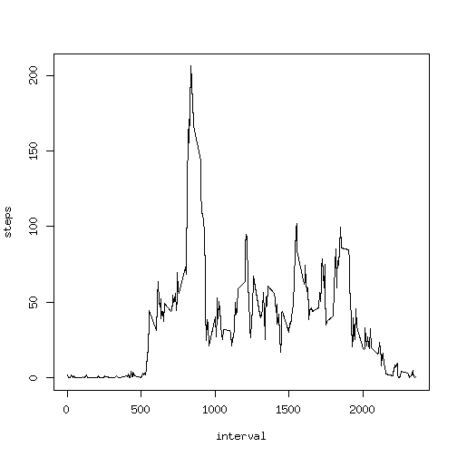
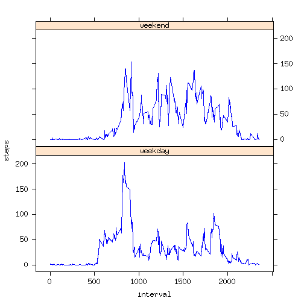

# Loading and Preprocessing the Data

To be able to analysis the data, first we should loading the data.

* First let's download and unzip it if it doesn't exist yet :


```r
# first download the data if not exist
if( ! file.exists("activity.csv") ) {
    # first check if the compressed zip exist
    if( ! file.exists("activity.zip") ) {
        download.file(url = 
    "https://github.com/ZhifeiDing/RepData_PeerAssessment1/blob/master/activity.zip", 
        destfile = "activity.zip",method = "curl")
    }
    # Then extract the downloaded zip file
    unzip("activity.zip")
}
```

* Then we can load data into R and have a little check on its data


```r
dataActivity <- read.csv("activity.csv")
str(dataActivity)
```

```
## 'data.frame':	17568 obs. of  3 variables:
##  $ steps   : int  NA NA NA NA NA NA NA NA NA NA ...
##  $ date    : Factor w/ 61 levels "2012-10-01","2012-10-02",..: 1 1 1 1 1 1 1 1 1 1 ...
##  $ interval: int  0 5 10 15 20 25 30 35 40 45 ...
```

* As we see from the `str(dataActivity)`'s output, it's better to transform the `date` field in `dataActivity` to `Date` class. Let's do it:


```r
dataActivity$date <- as.Date(dataActivity$date, format = "%Y-%m-%d")
```

# Course Project Questions

## What is mean total number of steps taken per day ?

* First let's make a histogram of the total number of steps taken each day


```r
require(dplyr)
# first group the data by date
dataGroupByDate <- group_by(dataActivity, date)
stepsPerDay <- summarize(dataGroupByDate, steps = sum(steps,na.rm = TRUE))
with(stepsPerDay, hist(steps))
```

 

* Then calculate and report the *mean* and *median* total number of steps taken per day


```r
meanStepsPerDay <- summarize(dataGroupByDate, 
                meanSteps = mean(steps, na.rm = TRUE))
meanStepsPerDay
```

```
## Source: local data frame [61 x 2]
## 
##          date meanSteps
## 1  2012-10-01       NaN
## 2  2012-10-02   0.43750
## 3  2012-10-03  39.41667
## 4  2012-10-04  42.06944
## 5  2012-10-05  46.15972
## 6  2012-10-06  53.54167
## 7  2012-10-07  38.24653
## 8  2012-10-08       NaN
## 9  2012-10-09  44.48264
## 10 2012-10-10  34.37500
## ..        ...       ...
```

```r
medianStepsPerDay <- summarize(dataGroupByDate,
                medianSteps = median(steps, na.rm = TRUE))
medianStepsPerDay
```

```
## Source: local data frame [61 x 2]
## 
##          date medianSteps
## 1  2012-10-01          NA
## 2  2012-10-02           0
## 3  2012-10-03           0
## 4  2012-10-04           0
## 5  2012-10-05           0
## 6  2012-10-06           0
## 7  2012-10-07           0
## 8  2012-10-08          NA
## 9  2012-10-09           0
## 10 2012-10-10           0
## ..        ...         ...
```

## What is the average daily activity pattern ?

To figure out this question, we need do things like below :

* Make a time series plot of the 5-minute interval and the average number of steps taken, averaged across all days


```r
# group data by interval and mean it
dataGroupByInterval <- dataActivity %>% group_by(interval)
averagedStepsAllDay <- dataGroupByInterval %>% 
            summarise(steps = mean(steps, na.rm = TRUE))
with(averagedStepsAllDay, plot(interval, 
        steps , type = "l", xlab = "interval", ylab = "steps"))
```

 

* Which 5-minute interval, on average across all the days in the dataset, contain the maximum number os steps ?


```r
averagedStepsAllDay[which.max(averagedStepsAllDay$steps),]
```

```
## Source: local data frame [1 x 2]
## 
##   interval    steps
## 1      835 206.1698
```

## Imputing missing values

Note that there are a number of days/intervals where there are missing values. The presence of missing days may introduce bias into some calculations or summaries of the data. 

* Calculate and report the total number of missing values in the dataset(i.e. the total number of rows with `NA`S )


```r
naRows <- dim(filter(dataActivity,is.na(dataActivity$steps)))[1]
naRows
```

```
## [1] 2304
```

* Devise a strategy for filling in all of the missing values in the dataset. The strategy doesn't need to be sophisticated. Here I use the average of that day

* And I create a new dataset called `dataGood`

```r
dataGood <- dataActivity
naSteps <- which(is.na(dataActivity$steps))
dataGood[naSteps,1] <- averagedStepsPerDay[naSteps]
```

* Make a histogram of the total number of steps taken each day and Calculate and report the **mean** and **median** total number of steps taken per day. Do these values differ from the estimates from the first part of the assignment? What is the impact of imputing missing data on the estimates of the total daily number of steps?


```r
# first group the data by date
dataGoodGroupByDate <- group_by(dataGood, date)
stepsPerDay <- summarize(dataGoodGroupByDate, steps = sum(steps))
# make histogram
with(stepsPerDay, hist(steps))
```

 

```r
# calculate the mean and median value
meanStepsPerDay <- summarize(dataGoodGroupByDate, meanSteps = mean(steps, na.rm = TRUE))
meanStepsPerDay
```

```
## Source: local data frame [61 x 2]
## 
##          date meanSteps
## 1  2012-10-01   0.00000
## 2  2012-10-02   0.43750
## 3  2012-10-03  39.41667
## 4  2012-10-04  42.06944
## 5  2012-10-05  46.15972
## 6  2012-10-06  53.54167
## 7  2012-10-07  38.24653
## 8  2012-10-08   0.00000
## 9  2012-10-09  44.48264
## 10 2012-10-10  34.37500
## ..        ...       ...
```

```r
medianStepsPerDay <- summarize(dataGoodGroupByDate, medianSteps = 
                               median(steps, na.rm = TRUE))
medianStepsPerDay
```

```
## Source: local data frame [61 x 2]
## 
##          date medianSteps
## 1  2012-10-01           0
## 2  2012-10-02           0
## 3  2012-10-03           0
## 4  2012-10-04           0
## 5  2012-10-05           0
## 6  2012-10-06           0
## 7  2012-10-07           0
## 8  2012-10-08           0
## 9  2012-10-09           0
## 10 2012-10-10           0
## ..        ...         ...
```

* The difference is that there are no *NULL* or *NA* in the computed *mean* and *median* value. Because I have use `na.rm = TRUE` in all the above statistics, so not very obvious impact
        
## Are there differences in activity patterns between weekdays and weekends

For this part the `weekdays()` function may be of some help here. Use the dataset with the filled-in missing values for this part.

* Create a new factor variable in the dataset with two levels -- "weekday" and "weekend" indicating whether a given date is a weekday or weekend day.


```r
weekendOrNot <- weekdays(dataGood$date)
weekendOrNot <- (weekendOrNot %in% c("Sunday","Saturday"))
dataGood$weekendOrNot <- factor(weekendOrNot, 
                        labels = c("weekday","weekend"))
str(dataGood)
```

```
## 'data.frame':	17568 obs. of  4 variables:
##  $ steps       : num  0 0 0 0 0 0 0 0 0 0 ...
##  $ date        : Date, format: "2012-10-01" "2012-10-01" ...
##  $ interval    : int  0 5 10 15 20 25 30 35 40 45 ...
##  $ weekendOrNot: Factor w/ 2 levels "weekday","weekend": 1 1 1 1 1 1 1 1 1 1 ...
```

* Make a panel plot containing a time series plot (i.e. type = "l") of the 5-minute interval (x-axis) and the average number of steps taken, averaged across all weekday days or weekend days (y-axis). 


```r
library(lattice)
# first group the data by intervals and weekendOrNot and calculate the averaged steps
stepsAveraged <- dataGood %>% 
    group_by(weekendOrNot, interval) %>% summarize(steps = mean(steps))
with(stepsAveraged, xyplot(steps ~ interval | weekendOrNot, 
    type = "l", col = "blue", layout= c(1,2),panel = function(...) { 
    panel.xyplot(...)
}))
```

 
